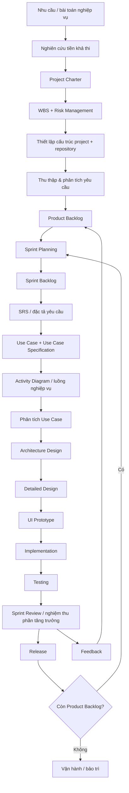

# IT3180 — Quy trình Project Phát triển Phần mềm

> Tài liệu này tổng hợp **flow project xuyên suốt môn IT3180** từ các slide Project đã cung cấp.  
> Mục tiêu là trả lời rõ 4 câu hỏi ở mỗi bước:
>
> 1. **Bước này để làm gì?**
> 2. **Input là gì?**
> 3. **Phải làm những việc gì?**
> 4. **Output / tài liệu nào được tạo ra và chuyển sang bước tiếp theo?**

---

## 1. Bức tranh tổng thể

Project không được hiểu là “nhận đề rồi code”, mà là một chuỗi hoạt động Software Engineering có quản lý:



### Hai lớp quy trình cần phân biệt

Có hai loại hoạt động:

**A. Hoạt động khởi tạo / quản lý project**  
Thường làm mạnh ở đầu project rồi cập nhật khi cần:

- nghiên cứu tiền khả thi;
- Project Charter;
- WBS;
- Risk Management;
- cấu trúc thư mục;
- repository;
- quy ước làm việc.

**B. Vòng lặp phát triển theo Sprint**  
Lặp lại cho đến khi Product Backlog được xử lý đủ:

```text
Product Backlog
      ↓
Sprint Planning
      ↓
Sprint Backlog
      ↓
Requirement / Analysis
      ↓
Design
      ↓
Implementation
      ↓
Testing
      ↓
Review
      ↓
Release
      ↓
Feedback → cập nhật Product Backlog
```

Task Board được dùng xuyên suốt Sprint để theo dõi trạng thái công việc:

```text
Backlog → To Do → In Progress → Review → Done
```

---

# 2. Chuỗi tài liệu xuyên suốt project

Đây là quan hệ quan trọng nhất cần nhớ:

```text
Business need / stakeholder information
        ↓
Project Charter
        ↓
WBS + Risk Management Plan
        ↓
Product Backlog
        ↓
Sprint Backlog
        ↓
SRS
        ↓
Use Case Model
        ↓
Use Case Specification
        ↓
Activity Diagram
        ↓
Analysis Model
        ↓
Sequence Diagram
        ↓
Architecture Design
        ↓
Database Design + Detailed Class Design
        ↓
UI Prototype
        ↓
Source Code
        ↓
Test Cases
        ↓
Test Results
        ↓
Release / Feedback
```

Không phải tài liệu nào cũng được viết lại từ đầu.  
Mỗi tài liệu **làm rõ thêm một mức** của tài liệu trước.

---

# 3. Bảng tổng hợp Input → Process → Output

| # | Giai đoạn | Input chính | Công việc chính | Output / tài liệu chuyển giao |
|---|---|---|---|---|
| 0 | Nghiên cứu tiền khả thi | Nhu cầu, bối cảnh, stakeholder | Thu thập dữ liệu, xác định nhu cầu, đánh giá sơ bộ | Thông tin dự án ban đầu, cơ sở chọn cách tổ chức project |
| 1 | Project Charter | Kết quả khảo sát ban đầu | Xác định mục tiêu, phạm vi, team, stakeholder, lịch trình, truyền thông | **Project Charter** |
| 2 | WBS | Scope, sản phẩm bàn giao | Phân rã project theo sản phẩm/quy trình | **WBS** |
| 3 | Risk Management | Charter, WBS, giả định/ràng buộc | Xác định, phân tích, xử lý rủi ro | **Risk Management Plan / Risk Register** |
| 4 | Project Repository | Charter, WBS, quy ước nhóm | Tạo cấu trúc thư mục, source tree, Git repository, quyền truy cập | **Repository + cấu trúc project** |
| 5 | Product Planning | Yêu cầu stakeholder | Viết User Story, estimate, ưu tiên, acceptance criteria | **Product Backlog** |
| 6 | Sprint Planning | Product Backlog | Chọn User Story, chia task, estimate, phân công | **Sprint Backlog** |
| 7 | Requirement Engineering | User Story, business process | Khảo sát nghiệp vụ, xác định chức năng/NFR | **SRS** |
| 8 | Use Case Modeling | SRS | Xác định actor, use case, phân rã use case | **Use Case Diagram** |
| 9 | Use Case Specification | Use Case Diagram | Mô tả main flow, alternative flow, pre/post-condition | **Use Case Specification** |
| 10 | Activity Modeling | Use Case Specification | Mô hình hóa luồng hành động | **Activity Diagram** |
| 11 | Analysis Model | Use Case Specification | Xác định Boundary/Controller/Entity, trách nhiệm đối tượng | **Analysis Class Model + Sequence Diagram** |
| 12 | Architecture Design | Analysis Model | Chọn MVC, tổ chức package/layer | **Architecture / Package Diagram** |
| 13 | Detailed Design | Architecture + Analysis Model | Thiết kế DB, bảng, quan hệ, class chi tiết | **ERD + Relational Schema + Detailed Class Diagram** |
| 14 | UI Prototype | Requirement + Use Case + Design | Layout, wireframe, màu, navigation, evaluation | **UI Prototype + navigation flow + feedback** |
| 15 | Implementation | Design + Prototype + Coding Convention | Code theo task/branch, commit, PR, review | **Source Code + Pull Request / merged code** |
| 16 | Testing | SRS, acceptance criteria, source code | White-box, black-box, thiết kế test case, chạy test | **Test Cases + Test Results** |
| 17 | Sprint Review / Release | Increment đã test | Review, demo, chấp nhận hoặc yêu cầu sửa | **Accepted Increment / Release + Feedback** |
| 18 | Maintenance / Next Sprint | Feedback + backlog còn lại | Cập nhật backlog hoặc bảo trì | **Updated Product Backlog / maintenance work** |

---

# 4. Quy trình chi tiết từng bước

---

## Bước 0 — Nghiên cứu tiền khả thi

### Mục tiêu

Hiểu xem project là gì trước khi lập kế hoạch chi tiết.

### Input

- nhu cầu của khách hàng;
- vấn đề hiện tại;
- thông tin stakeholder;
- quy trình nghiệp vụ hiện tại;
- nguồn lực sơ bộ;
- ràng buộc;
- dữ liệu khảo sát ban đầu.

### Việc phải làm

1. Thu thập dữ liệu.
2. Xác định nhu cầu.
3. Làm rõ mục tiêu.
4. Xác định stakeholder.
5. Đánh giá sơ bộ:
   - phạm vi;
   - quy mô;
   - nguồn lực;
   - thời gian;
   - rủi ro;
   - tính khả thi.
6. Lựa chọn cách tổ chức phát triển phù hợp.

Trong case study của môn, project được xác định phù hợp với **Agile sử dụng Scrum**.

### Output

- project context;
- danh sách stakeholder sơ bộ;
- mục tiêu sơ bộ;
- scope sơ bộ;
- các giả định/ràng buộc ban đầu;
- cơ sở để viết Project Charter.

### Chuyển sang

```text
Feasibility information
        ↓
Project Charter
```

---

# Bước 1 — Xây dựng Project Charter

## Mục tiêu

Tạo “tờ khai sinh” chính thức cho project.

Project Charter trả lời:

> Project này là gì, vì sao tồn tại, ai làm, phạm vi đến đâu và cách project được quản lý ở mức tổng quan?

## Input

- kết quả nghiên cứu ban đầu;
- business need;
- stakeholder;
- phạm vi sơ bộ;
- nguồn lực và ràng buộc.

## Nội dung phải làm

Theo tài liệu môn học, Project Charter gồm:

### 1. Thông tin chung

- tên dự án;
- nhà tài trợ;
- đơn vị thực hiện;
- mức độ ảnh hưởng của dự án.

### 2. Đội ngũ thực hiện

- Project Manager;
- các thành viên;
- thông tin liên hệ.

### 3. Các bên liên quan

Xác định:

- đại diện khách hàng;
- đại diện người dùng cuối;
- bên kinh doanh;
- các stakeholder khác.

### 4. Tuyên bố phạm vi

Làm rõ:

- bối cảnh và động cơ;
- mục đích / mục tiêu;
- sản phẩm bàn giao;
- phạm vi;
- kinh phí;
- lịch trình;
- rủi ro và giả định;
- ràng buộc;
- các yếu tố bên ngoài.

### 5. Chiến lược truyền thông

Ví dụ:

- Daily meeting;
- báo cáo tiến độ;
- review theo milestone;
- kênh giao tiếp.

### 6. Phê duyệt

Xác định người chịu trách nhiệm phê duyệt project.

## Output

```text
Project Charter
```

## Tài liệu này được dùng bởi

- WBS;
- Risk Management;
- Requirement Engineering;
- Sprint Planning;
- quản lý scope trong toàn project.

---

# Bước 2 — Xây dựng WBS

**WBS — Work Breakdown Structure**

## Mục tiêu

Phân rã project lớn thành các phần đủ nhỏ để:

- hiểu project phải làm những gì;
- estimate;
- giao việc;
- theo dõi;
- kiểm soát scope.

## Input

- Project Charter;
- Project Scope;
- deliverables;
- business functions.

## Hai cách phân rã được trình bày trong môn

### A. Theo sản phẩm

Ví dụ:

```text
Phần mềm
├── Quản lý thu phí
│   ├── Tạo khoản thu
│   ├── Thu phí
│   └── Thống kê
├── Quản lý người dùng
└── Quản lý hộ gia đình
```

### B. Theo quy trình

Ví dụ:

```text
Project
├── Quản lý dự án
├── Xây dựng phần mềm
├── Chăm sóc / hỗ trợ
└── Vận hành
```

## Việc phải làm

1. Xác định deliverable lớn.
2. Chia thành component / subsystem.
3. Tiếp tục phân rã thành work package.
4. Dừng khi work package đủ nhỏ để:
   - estimate;
   - assign;
   - track.

## Output

```text
WBS
```

## Chuyển sang

WBS là input quan trọng cho:

```text
WBS
 ├── estimation
 ├── planning
 ├── risk identification
 └── task decomposition
```

---

# Bước 3 — Risk Management

## Mục tiêu

Không đợi rủi ro xảy ra mới xử lý.

## Input

- Project Charter;
- scope;
- WBS;
- team/resource information;
- technical assumptions;
- schedule;
- constraints.

## Quy trình

### 3.1 Xác định rủi ro

Liệt kê các rủi ro có thể ảnh hưởng project.

Có thể thuộc nhóm:

- con người;
- kỹ thuật;
- tiến độ;
- requirement;
- communication;
- resource;
- external dependency.

### 3.2 Phân tích ảnh hưởng

Đánh giá:

- probability;
- impact;
- mức độ ưu tiên.

### 3.3 Xử lý rủi ro

Xác định:

- hành động ngăn ngừa;
- hành động giảm thiểu;
- phương án khi risk xảy ra;
- người chịu trách nhiệm.

## Output

```text
Risk Management Plan
hoặc
Risk Register
```

Một record tối thiểu nên thể hiện:

```text
Risk
Probability
Impact
Risk level
Preventive action
Response
Owner
Status
```

## Chuyển sang

Risk Plan ảnh hưởng đến:

- Sprint priority;
- technical design;
- allocation nguồn lực;
- schedule;
- Definition of Done.

---

# Bước 4 — Thiết lập cấu trúc Project và Repository

## Mục tiêu

Đảm bảo code và tài liệu có:

- nơi lưu rõ ràng;
- version;
- quyền truy cập;
- khả năng review;
- khả năng truy vết.

## Input

- cấu trúc project;
- loại tài liệu;
- team;
- source code;
- workflow đã thống nhất.

## Phần A — Tổ chức thư mục

Các bước tài liệu môn học đưa ra:

1. Chọn định dạng chuẩn.
2. Quy ước đặt tên.
3. Tạo cấu trúc thư mục.
4. Chọn vị trí lưu trữ.
5. Kiểm soát truy nhập và version.
6. Cập nhật thường xuyên.

Cấu trúc mẫu của môn:

```text
IT3180-GroupX/
├── 01-ManagedArea/
├── 02-FreeZone/
├── 03-SourceCodes/
└── 04-Users/
    └── <UserID>/
```

Ngoài ra có thể có:

- working area;
- review area;
- release area.

## Phần B — Tạo Git Repository

Repository là nơi quản lý source/version.

## Phần C — Workflow với Git

Flow slide đưa ra:

```text
Chọn bug / feature
      ↓
Checkout nhánh phù hợp
      ↓
Pull thay đổi mới nhất
      ↓
Tạo branch cho bug / feature
      ↓
Code + Commit
      ↓
Push
      ↓
Pull Request
      ↓
Review / Merge
```

## Output

- project folder structure;
- source repository;
- access permissions;
- branch/PR workflow;
- versioned project artifacts.

---

# Bước 5 — Xây dựng Product Backlog

## Mục tiêu

Biến nhu cầu của khách hàng thành danh sách chức năng có thể quản lý và ưu tiên.

## Input

- stakeholder requirements;
- business process;
- Project Charter;
- initial scope;
- customer feedback.

## Các bước theo tài liệu

### 1. Thu thập yêu cầu

Trao đổi với:

- khách hàng;
- người dùng;
- stakeholder.

### 2. Viết yêu cầu thành User Story

Format:

```text
As a <user>
I want <feature>
So that <value>
```

### 3. Estimate

Ước lượng độ phức tạp / effort.

### 4. Xác định Non-functional Requirements

Ví dụ:

- performance;
- security;
- support;
- constraint.

### 5. Prioritize

Sắp xếp User Story theo:

- độ quan trọng;
- giá trị khách hàng;
- dependency;
- risk.

### 6. Acceptance Criteria

Mô tả điều kiện để User Story được coi là đáp ứng yêu cầu.

### 7. Cập nhật thường xuyên

Product Backlog **không phải tài liệu cố định**.

### 8. Xác nhận lại với khách hàng

Đảm bảo hiểu đúng yêu cầu.

## Output

```text
Product Backlog
```

Mỗi Product Backlog Item nên có ít nhất:

```text
ID
User Story
Priority
Estimate
Acceptance Criteria
Status
```

## Chuyển sang

```text
Product Backlog
      ↓
Sprint Planning
```

---

# Bước 6 — Sprint Planning và Sprint Backlog

## Mục tiêu

Chọn một phần Product Backlog đủ để team xử lý trong Sprint.

## Input

- Product Backlog;
- priority;
- estimate;
- team capacity;
- dependency;
- risk.

## Các bước

### 1. Chọn User Story

Chọn các User Story từ Product Backlog.

### 2. Chia User Story thành Task

Task phải đủ nhỏ để thực hiện và theo dõi.

Ví dụ:

```text
US: Kế toán tạo khoản thu

├── Thiết kế form
├── Thiết kế DB
├── Implement API
├── Implement validation
├── Implement UI
└── Test
```

### 3. Estimate task

Gán:

- effort;
- thời gian;
- resource.

### 4. Đưa task vào Sprint Backlog

### 5. Viết chi tiết task

Bao gồm:

- việc cần làm;
- yêu cầu kỹ thuật;
- dependency nếu có.

### 6. Theo dõi trạng thái

Task Board:

```text
Backlog
  ↓
To Do
  ↓
In Progress
  ↓
Review
  ↓
Done
```

### 7. Daily Scrum

Cập nhật:

- tiến độ;
- blocker;
- thay đổi Sprint Backlog khi cần.

## Output

```text
Sprint Backlog
Task Board
Sprint Goal
```

---

# Bước 7 — Requirement Engineering và SRS

## Mục tiêu

Biến yêu cầu dạng business/User Story thành requirement đủ rõ để thiết kế và lập trình.

## Input

- Product Backlog;
- User Story;
- Acceptance Criteria;
- business workflow;
- stakeholder information;
- biểu mẫu / dữ liệu nghiệp vụ hiện tại.

## Hoạt động

### 1. Khảo sát nghiệp vụ

Hiểu:

- người dùng hiện làm gì;
- dữ liệu gì được dùng;
- thứ tự xử lý;
- quy tắc nghiệp vụ.

### 2. Phân rã chức năng

Từ business domain → nhóm chức năng → chức năng cụ thể.

### 3. Viết SRS

Cấu trúc SRS trong tài liệu môn học gồm:

#### A. Giới thiệu chung

- mục đích;
- phạm vi;
- thuật ngữ;
- tài liệu tham khảo.

#### B. Mô tả tổng quan hệ thống

- context;
- business process;
- đối tượng sử dụng.

#### C. Đặc tả chức năng

- actor;
- chức năng;
- use case;
- hành vi hệ thống.

#### D. Non-functional Requirement / Constraint

- yêu cầu phi chức năng;
- ràng buộc.

## Output

```text
Software Requirements Specification — SRS
```

## Chuyển sang

```text
SRS
 ↓
Actor identification
 ↓
Use Case Model
```

---

# Bước 8 — Xây dựng Use Case Model

## Mục tiêu

Biểu diễn **ai tương tác với hệ thống và tương tác để làm gì**.

## Input

- SRS;
- danh sách chức năng;
- stakeholder/user roles.

## Quy trình

### 1. Xác định actor

Ví dụ:

```text
Kế toán
Cán bộ quản lý
...
```

### 2. Xác định Use Case

Ví dụ:

```text
Đăng nhập
Tạo khoản thu
Thu phí
Thống kê
...
```

### 3. Vẽ Use Case tổng quan

### 4. Phân rã Use Case

Một use case lớn có thể được chia thành các use case cụ thể.

## Output

```text
Actor List
Use Case List
Use Case Diagram
Decomposed Use Case Diagram
```

---

# Bước 9 — Viết Use Case Specification

## Mục tiêu

Biến một vòng tròn trên Use Case Diagram thành **một flow xử lý rõ ràng**.

## Input

- Use Case Diagram;
- SRS;
- business rules.

## Nội dung

Một Use Case Specification cần làm rõ:

```text
Use Case
Actor
Mục đích
Precondition
Main Flow
Alternative Flow
Postcondition
```

Ví dụ logic:

```text
Actor thực hiện hành động
        ↓
System phản hồi
        ↓
Actor tiếp tục
        ↓
System validate
        ↓
System lưu dữ liệu
```

Phải mô tả cả:

- luồng thành công;
- luồng thay thế;
- trường hợp lỗi cần thiết.

## Output

```text
Detailed Use Case Specification
```

## Chuyển sang

Use Case Specification được dùng trực tiếp cho:

- Activity Diagram;
- Analysis Class;
- Sequence Diagram;
- UI;
- Test Case.

---

# Bước 10 — Activity Diagram

## Mục tiêu

Mô hình hóa trực quan luồng hành động của Use Case.

## Input

- Main Flow;
- Alternative Flow;
- business condition.

## Việc phải làm

1. xác định start;
2. các action;
3. decision;
4. branch;
5. merge;
6. end.

Phải biểu diễn được cả:

- luồng chính;
- luồng thay thế quan trọng.

## Output

```text
Activity Diagram
```

## Giá trị chuyển giao

Activity Diagram giúp:

- dev hiểu flow;
- UI hiểu navigation;
- tester xác định path;
- designer hiểu decision point.

---

# Bước 11 — Phân tích Use Case

## Mục tiêu

Bắt đầu chuyển từ **requirement model** sang **software model**.

## Input

- Use Case Diagram;
- Use Case Specification;
- Activity Diagram.

## Hoạt động

### 1. Xác định các lớp phân tích

Theo cách tiếp cận trong slide:

#### Boundary

Đại diện interface giữa actor và system.

Ví dụ:

```text
FormThemKhoanThu
```

#### Controller

Điều phối logic Use Case.

Ví dụ:

```text
QuanLyKhoanThuController
```

#### Entity

Đại diện dữ liệu nghiệp vụ.

Ví dụ:

```text
KhoanThu
```

### 2. Phân bổ trách nhiệm

Xác định object nào xử lý bước nào.

### 3. Vẽ Sequence Diagram

Biểu diễn message giữa:

```text
Actor
 → Boundary
 → Controller
 → Entity
 → Database / Model
```

### 4. Xây dựng Analysis Class Diagram

## Output

```text
Analysis Class Model
Sequence Diagram
Responsibility Assignment
```

## Chuyển sang

```text
Analysis Model
       ↓
Architecture Design
```

---

# Bước 12 — Thiết kế kiến trúc

## Mục tiêu

Xác định hệ thống sẽ được tổ chức thành những phần nào và trách nhiệm của từng phần.

## Input

- analysis model;
- use cases;
- NFR;
- technical constraints.

## Kiến trúc được dùng trong project mẫu

**MVC — Model View Controller**

### Model

- dữ liệu;
- business information.

### View

- giao diện;
- tương tác người dùng.

### Controller

- logic xử lý;
- điều phối Model và View.

## Package Design

Project mẫu phân chia:

```text
models/
views/
controllers/
```

và có thể tiếp tục chia theo Use Case / feature.

## Output

```text
Architecture Design
Package Diagram
Component responsibility
```

---

# Bước 13 — Thiết kế chi tiết

## Mục tiêu

Đưa architecture xuống mức dev có thể bắt đầu implement.

## Input

- architecture;
- analysis classes;
- sequence diagrams;
- SRS;
- data requirements.

---

## 13.1 Database Design

### A. Conceptual Model

Xác định:

- entity;
- attribute;
- relationship.

Tạo:

```text
ER Diagram
```

### B. Logical Model

Chuyển từ ERD thành:

```text
Table
Primary Key
Foreign Key
Relationship
```

Tạo:

```text
Relational Schema
```

---

## 13.2 Detailed Class Design

Xác định:

- class;
- attribute;
- method;
- relationship;
- responsibility.

Tạo:

```text
Detailed Class Diagram
```

## Output

```text
ER Diagram
Relational Schema
Detailed Class Diagram
```

## Chuyển sang

```text
Detailed Design
      ↓
Implementation
```

---

# Bước 14 — UI Prototype

## Mục tiêu

Kiểm tra giao diện và flow **trước khi đầu tư code hoàn chỉnh**.

## Input

- SRS;
- Use Case;
- Activity Diagram;
- actor;
- navigation;
- functional requirements.

## Quy trình

### 1. Thiết kế bố cục

Xác định layout màn hình.

### 2. Bản đơn sắc

Wireframe / low-fidelity prototype.

### 3. Bản phối màu

Tạo version trực quan hơn.

### 4. Thiết kế navigation

Mô tả người dùng đi:

```text
Screen A
  ↓
Screen B
  ↓
Screen C
```

### 5. Đánh giá prototype

Các câu hỏi trong tài liệu gồm:

- có đáp ứng yêu cầu khách hàng không?
- thông tin/chức năng có dễ tìm không?
- bố cục có hợp lý không?
- UI có dễ đọc không?
- thao tác có dễ không?

### 6. Thiết kế lại khi cần

Flow:

```text
Design
  ↓
Prototype
  ↓
Evaluate
  ↓
Feedback
  ↓
Redesign
  ↓
Approved Design
```

## Output

```text
Wireframe
UI Prototype
Navigation Flow
Prototype Evaluation
Approved UI Design
```

---

# Bước 15 — Coding Convention và Implementation

## Mục tiêu

Biến thiết kế thành code nhưng vẫn bảo đảm code của cả team nhất quán.

## Input

- Sprint Backlog;
- architecture;
- database design;
- class design;
- prototype;
- coding convention.

## Coding Convention

Tài liệu môn học nhấn mạnh các nhóm quy ước:

- indentation;
- whitespace;
- line length;
- naming;
- declaration;
- expression;
- comment;
- documentation.

Project mẫu sử dụng Java và tham khảo convention của Sun.

## Implementation Flow

Kết hợp với Git workflow:

```text
Task
 ↓
Create / checkout branch
 ↓
Pull latest changes
 ↓
Implement
 ↓
Local test
 ↓
Commit
 ↓
Push
 ↓
Pull Request
 ↓
Review
 ↓
Merge
```

## Output

```text
Source Code
Commit History
Pull Request
Reviewed / Merged Code
```

> Lưu ý: bộ tài liệu được cung cấp không có file `Pr09`; tổng quan project vẫn nêu rõ bước **Phát triển / lập trình**, còn `Pr10` tập trung vào coding convention và phong cách lập trình.

---

# Bước 16 — Testing

## Mục tiêu

Chứng minh phần mềm đáp ứng requirement và logic code hoạt động đúng.

## Input

### Từ Requirement

- SRS;
- Use Case;
- Acceptance Criteria;
- business rule.

### Từ Implementation

- source code;
- database;
- executable system.

## Hai hướng kiểm thử trong project

---

## 16.1 White-box Testing

### Input

Source code / control logic.

### Việc phải làm

1. đọc code;
2. xây dựng Control Flow;
3. xác định các execution path;
4. chọn dữ liệu test để đi qua các path;
5. thiết kế Test Case;
6. execute;
7. ghi kết quả.

### Output

```text
Control Flow Graph
Execution Paths
White-box Test Cases
White-box Test Results
```

---

## 16.2 Black-box Testing

### Input

Requirement/specification.

Không cần dựa vào cấu trúc code bên trong.

### Việc phải làm

1. xác định input;
2. xác định expected output;
3. xác định điều kiện;
4. tạo các trường hợp hợp lệ/không hợp lệ;
5. viết Test Case;
6. chạy;
7. so sánh expected vs actual.

Test Case có thể có dạng:

```text
Test Case ID
Input
Precondition
Expected Outcome
Actual Outcome
Result: Passed / Failed
Note
```

## Output

```text
Black-box Test Cases
Black-box Test Results
```

## Điều kiện hoàn thành

Feature chỉ nên sang trạng thái `Done` khi:

- test đã chạy;
- kết quả phù hợp expectation;
- acceptance criteria được đáp ứng;
- lỗi blocking đã xử lý.

---

# Bước 17 — Sprint Review và Release

## Mục tiêu

Đánh giá phần tăng trưởng được tạo trong Sprint.

## Input

- completed increment;
- test results;
- acceptance criteria;
- Sprint Goal.

## Sprint Review

Team:

1. trình bày phần đã hoàn thành;
2. kiểm tra;
3. nhận feedback;
4. xác định phần được chấp nhận;
5. xác định phần cần sửa.

## Output

Một trong hai trạng thái:

```text
Accepted
```

hoặc:

```text
Change / Fix required
```

Feedback phải được đưa trở lại:

```text
Product Backlog
```

## Release

Nếu increment đạt điều kiện:

```text
Tested Increment
      ↓
Accepted Increment
      ↓
Release
```

## Output

```text
Release / Increment
Review Feedback
Updated Product Backlog
```

---

# Bước 18 — Sprint Retrospective

Sprint Review tập trung vào **sản phẩm**.

Sprint Retrospective tập trung vào **cách team làm việc**.

## Input

- dữ liệu Sprint;
- blocker;
- issue;
- velocity/tiến độ;
- trải nghiệm team.

## Câu hỏi

```text
Điều gì làm tốt?
Điều gì chưa tốt?
Sprint sau thay đổi gì?
```

## Output

```text
Process Improvement Actions
```

Các action này được áp dụng cho Sprint tiếp theo.

---

# Bước 19 — Next Sprint hoặc Maintenance

Sau Release:

```text
Có backlog còn lại?
```

### Nếu có

```text
Product Backlog
   ↓
Sprint Planning
   ↓
Sprint tiếp theo
```

### Nếu sản phẩm đã hoàn thành phạm vi chính

Chuyển sang:

```text
Operation
Maintenance
Bug fixing
Change request
Support
```

---

# 5. Traceability — một requirement đi xuyên project như thế nào?

Ví dụ một requirement:

> Kế toán cần tạo một khoản thu mới.

Nó không đứng độc lập mà phải trace được xuyên qua toàn project:

```text
Business Need
   ↓
User Story
   ↓
Product Backlog Item
   ↓
Sprint Backlog
   ↓
SRS Requirement
   ↓
Use Case: Tạo khoản thu
   ↓
Use Case Main / Alternative Flow
   ↓
Activity Diagram
   ↓
Boundary / Controller / Entity
   ↓
Sequence Diagram
   ↓
MVC / Package
   ↓
Database + Classes
   ↓
UI Prototype
   ↓
Source Code
   ↓
Test Cases
   ↓
Acceptance
```

Đây là nguyên tắc quan trọng nhất của tài liệu này:

> **Mỗi đoạn code nên có lý do tồn tại từ Requirement, và mỗi Requirement quan trọng phải trace được tới Design, Code và Test.**

---

# 6. Quan hệ giữa các tài liệu

## Project Charter vs SRS

### Project Charter

Trả lời:

> Chúng ta đang thực hiện project nào?

Quan tâm:

- mục tiêu;
- phạm vi;
- stakeholder;
- team;
- timeline;
- communication;
- project-level constraint.

### SRS

Trả lời:

> Phần mềm phải làm gì?

Quan tâm:

- chức năng;
- hành vi;
- business flow;
- non-functional requirement;
- constraint hệ thống.

---

## Product Backlog vs SRS

### Product Backlog

Là danh sách ưu tiên để **quản lý development**.

### SRS

Là tài liệu để **đặc tả requirement**.

Có quan hệ:

```text
Product Backlog Item
        ↕
SRS Requirement
```

Không nên coi hai thứ là một.

---

## Use Case vs Activity Diagram

### Use Case

Trả lời:

> Actor dùng hệ thống để đạt mục tiêu gì?

### Activity Diagram

Trả lời:

> Flow thực hiện Use Case đó diễn ra như thế nào?

---

## Analysis Model vs Design Model

### Analysis

Tập trung:

> Hệ thống cần có những trách nhiệm logic nào?

Ví dụ:

```text
Boundary
Controller
Entity
```

### Design

Tập trung:

> Những trách nhiệm đó được hiện thực bằng architecture, package, class, database thế nào?

---

## Prototype vs Source Code

Prototype dùng để xác nhận:

- UI;
- flow;
- usability.

Prototype không đồng nghĩa với implementation hoàn chỉnh.

---

## Test Case vs Acceptance Criteria

Acceptance Criteria nói:

> Điều kiện nào để requirement được chấp nhận?

Test Case nói:

> Ta sẽ đưa input gì vào để kiểm chứng điều kiện đó?

---

# 7. Artifact checklist

Trước khi coi project hoàn chỉnh, nên kiểm tra các artifact sau.

## Project Management

- [ ] Project Charter
- [ ] WBS
- [ ] Risk Management Plan
- [ ] Communication strategy
- [ ] Task Board

## Agile Management

- [ ] Product Backlog
- [ ] User Stories
- [ ] Acceptance Criteria
- [ ] Sprint Backlog
- [ ] Sprint Review feedback
- [ ] Retrospective actions

## Requirements

- [ ] Business workflow
- [ ] SRS
- [ ] Functional Requirements
- [ ] Non-functional Requirements
- [ ] Actor list
- [ ] Use Case Diagram
- [ ] Use Case Specification
- [ ] Activity Diagram

## Analysis & Design

- [ ] Analysis Class Model
- [ ] Sequence Diagram
- [ ] Architecture Design
- [ ] Package Diagram
- [ ] ER Diagram
- [ ] Relational Schema
- [ ] Detailed Class Diagram

## UI/UX

- [ ] Layout
- [ ] Wireframe / monochrome prototype
- [ ] Color prototype
- [ ] Navigation Flow
- [ ] Prototype Evaluation
- [ ] Approved Design

## Implementation

- [ ] Coding Convention
- [ ] Git branches
- [ ] Source Code
- [ ] Commits
- [ ] Pull Requests
- [ ] Code Review
- [ ] Merged Code

## Testing

- [ ] White-box test design
- [ ] Black-box test design
- [ ] Test Cases
- [ ] Expected Outcomes
- [ ] Actual Results
- [ ] Pass / Fail
- [ ] Defect fixing

## Release

- [ ] Sprint Review
- [ ] Accepted Increment
- [ ] Release
- [ ] Feedback
- [ ] Updated Product Backlog

---

# 8. Recommended repository structure

Phần này giữ tinh thần cấu trúc project trong tài liệu môn học, đồng thời làm rõ nơi chứa artifact.

```text
IT3180-GroupX/
│
├── 01-ManagedArea/
│   │
│   ├── 01-ProjectManagement/
│   │   ├── Project-Charter/
│   │   ├── WBS/
│   │   └── Risk-Management/
│   │
│   ├── 02-Requirements/
│   │   ├── Product-Backlog/
│   │   ├── SRS/
│   │   ├── Use-Cases/
│   │   └── Activity-Diagrams/
│   │
│   ├── 03-Design/
│   │   ├── Analysis-Model/
│   │   ├── Architecture/
│   │   ├── Database/
│   │   ├── Class-Design/
│   │   └── UI-Prototype/
│   │
│   ├── 04-Testing/
│   │   ├── Test-Cases/
│   │   └── Test-Results/
│   │
│   └── 05-Releases/
│
├── 02-FreeZone/
│
├── 03-SourceCodes/
│
├── 04-Users/
│   └── <UserID>/
│
└── README.md
```

> Tên thư mục con chi tiết ở trên là cách tổ chức khuyến nghị để biến các artifact của môn thành một repository dễ quản lý; cấu trúc cấp cao `01-ManagedArea`, `02-FreeZone`, `03-SourceCodes`, `04-Users` bám theo mẫu project của môn.

---

# 9. Quy tắc chuyển giao giữa các bước

Một bước chỉ nên được coi là xong khi output của nó đủ để bước tiếp theo bắt đầu.

## Requirement → Design

Không nên thiết kế khi Use Case còn mơ hồ.

Tối thiểu cần:

```text
Requirement rõ
Use Case rõ
Main flow rõ
Alternative flow đủ
Business rules rõ
```

## Design → Implementation

Không nên code feature lớn khi chưa hiểu:

```text
Data model
Responsibility
Interaction
UI flow
```

## Implementation → Testing

Code chưa đồng nghĩa với Done.

Phải có:

```text
Code
+
Testable requirement
+
Expected behavior
```

## Testing → Release

Chỉ release khi:

```text
Required Test Cases passed
+
Acceptance Criteria satisfied
+
Review accepted
```

---

# 10. Flow thực tế của một Sprint

Đây là flow nên dùng khi team bắt đầu một Sprint.

```text
1. Product Backlog Refinement
       ↓
2. Sprint Planning
       ↓
3. Chọn User Story
       ↓
4. Làm rõ Requirement / SRS
       ↓
5. Use Case + Activity Diagram
       ↓
6. Analysis + Design
       ↓
7. Prototype nếu liên quan UI
       ↓
8. Break technical tasks
       ↓
9. Create branch
       ↓
10. Implement
       ↓
11. Commit / Push
       ↓
12. Pull Request
       ↓
13. Review
       ↓
14. Testing
       ↓
15. Fix nếu fail
       ↓
16. Done
       ↓
17. Sprint Review
       ↓
18. Release / Feedback
       ↓
19. Retrospective
```

---

# 11. Definition of Done cho một Feature

Một feature không nên được coi là “Done” chỉ vì đã code xong.

Một checklist hợp với flow của project:

- [ ] Requirement đã được xác định rõ.
- [ ] User Story có Acceptance Criteria.
- [ ] Use Case / flow đã được làm rõ nếu cần.
- [ ] Design đã đủ để implement.
- [ ] Code tuân thủ convention.
- [ ] Code đã commit/push.
- [ ] Pull Request đã review.
- [ ] Test Cases đã được thiết kế.
- [ ] Các test bắt buộc đã pass.
- [ ] Acceptance Criteria đạt.
- [ ] Tài liệu liên quan được cập nhật.
- [ ] Feature có thể demo trong Sprint Review.

---

# 12. Những tài liệu nào là bắt buộc và tài liệu nào phụ thuộc project?

Tài liệu tổng quan của môn giới thiệu:

- SRS;
- BRD;
- FRS;
- UI/UX;
- Use Case;
- Data Flow;
- User Story.

Tuy nhiên chính slide cũng lưu ý:

> Không phải project nào cũng cần đồng thời SRS, BRD và FRS.

Trong chuỗi bài Project được cung cấp, artifact được hướng dẫn trực tiếp và rõ nhất gồm:

```text
Project Charter
WBS
Risk Management
Product Backlog
Sprint Backlog
SRS
Use Case
Activity Diagram
Analysis Model
Sequence Diagram
Architecture / Package Design
Database Design
Detailed Class Design
UI Prototype
Coding Convention
Source Code
Test Cases
Test Results
Release / Feedback
```

Do đó README này coi đây là **core flow của project môn học**.

---

# 13. Mapping với các file Project của môn

| File | Nội dung chính |
|---|---|
| `IT3180-Pr01_Prj-C2_final.pdf` | Quy trình áp dụng cho project + các loại tài liệu |
| `IT3180-Pr02_Prj-C3_final.pdf` | Agile Task Board + Product Backlog + Sprint Backlog |
| `IT3180_Pr03_Prj-C4_intro_final.pdf` | Project Charter + WBS + Risk Management |
| `IT3180_Pr04_Prj-C5_final.pdf` | Project folder + repository + Git workflow |
| `IT3180_Pr05_Prj-C6-P1_final.pdf` | Business flow + SRS |
| `IT3180_Pr06_Prj-C6-P2_final.pdf` | Use Case + Use Case detail + Activity Diagram |
| `IT3180_Pr07_Prj-C7-P1_final.pdf` | Analysis Model + MVC + Package + DB + Class Design |
| `IT3180_Pr08_Prj-C7_final.pdf` | UI Prototype + Navigation + Prototype Evaluation |
| `IT3180_Pr10_Prj-C8-CodingConvention_final.pdf` | Coding Convention |
| `IT3180_Pr11_Prj-C9-P1_final.pdf` | Software Testing — Part 1 |
| `IT3180_Pr12_Prj-C9-P2_final.pdf` | Software Testing — Part 2 |

---

# 14. Tóm tắt một câu

Toàn bộ project có thể rút lại thành:

```text
Hiểu đúng vấn đề
→ xác định đúng yêu cầu
→ lập kế hoạch
→ mô hình hóa yêu cầu
→ thiết kế hệ thống
→ thiết kế trải nghiệm
→ implement có quản lý version
→ test dựa trên requirement
→ review
→ release
→ nhận feedback
→ lặp lại.
```

**Software Engineering không phải là viết nhiều tài liệu rồi mới code.**

Ý nghĩa của các artifact là tạo ra một chuỗi truy vết:

```text
WHY
↓
WHAT
↓
HOW
↓
BUILD
↓
VERIFY
```

Trong đó:

```text
WHY     = Business Need / Project Charter
WHAT    = Product Backlog / SRS / Use Case
HOW     = Architecture / Detailed Design / Prototype
BUILD   = Source Code
VERIFY  = Testing / Acceptance / Review
```

Khi chuỗi này không bị đứt, team có thể giải thích được:

> Tại sao feature này tồn tại?  
> Ai yêu cầu?  
> Flow đúng là gì?  
> Thiết kế nào hiện thực nó?  
> Code nằm ở đâu?  
> Test nào chứng minh nó hoạt động đúng?

Đó chính là flow cốt lõi mà chuỗi Project IT3180 đang hướng tới.
