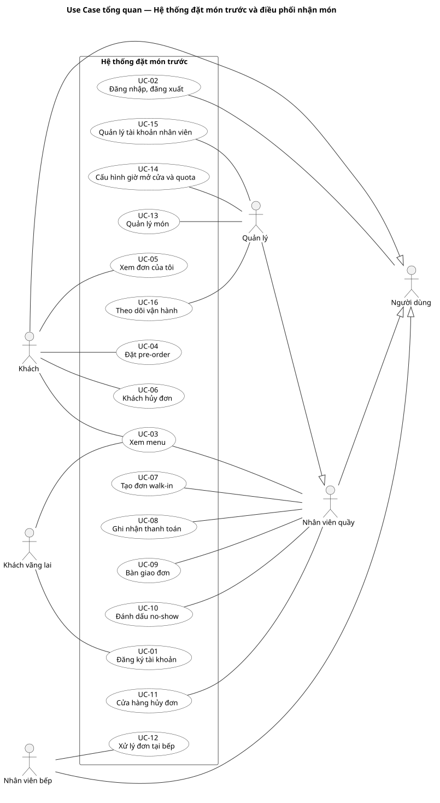
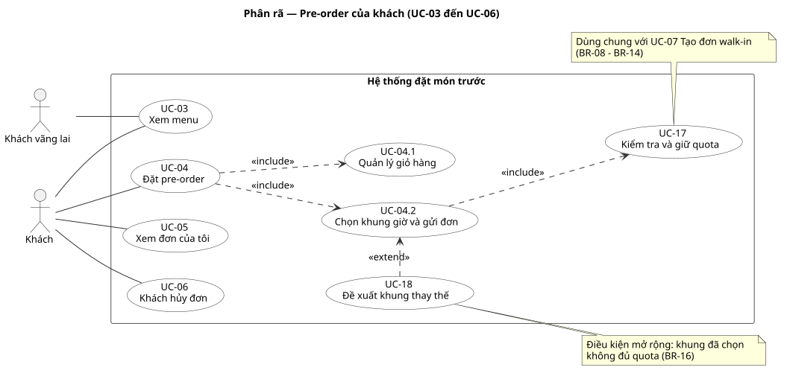
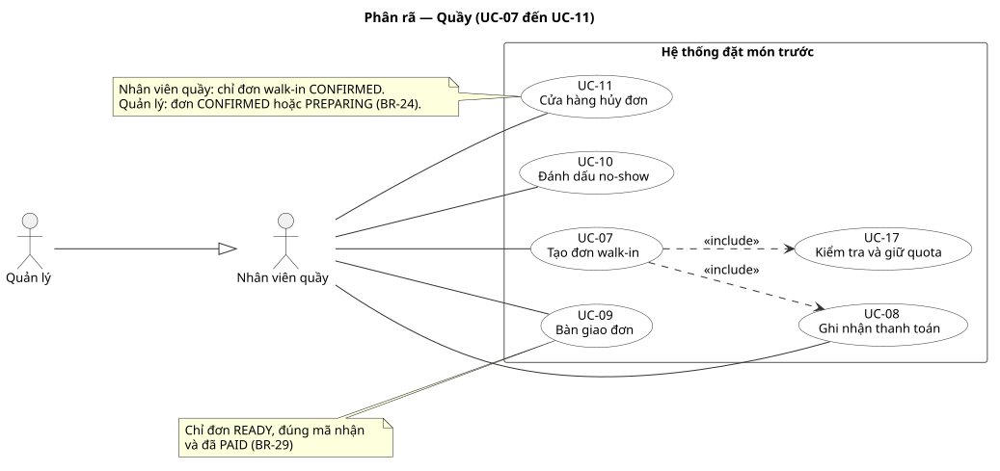
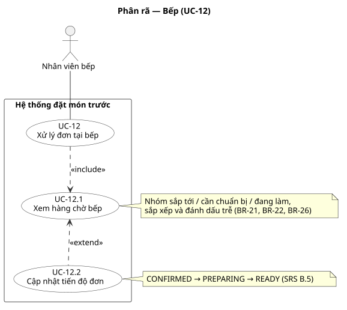
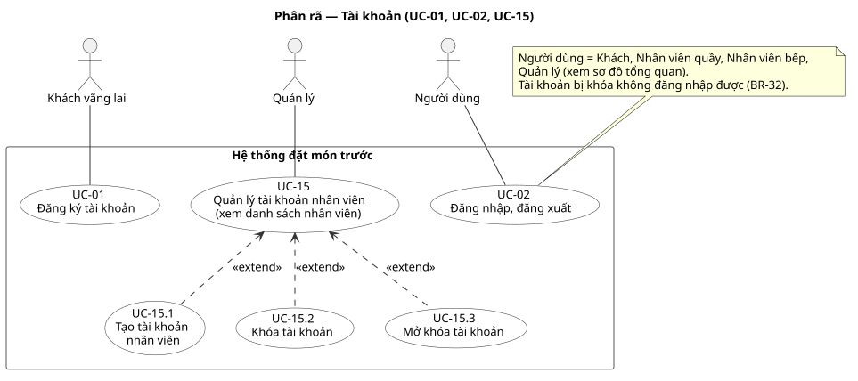
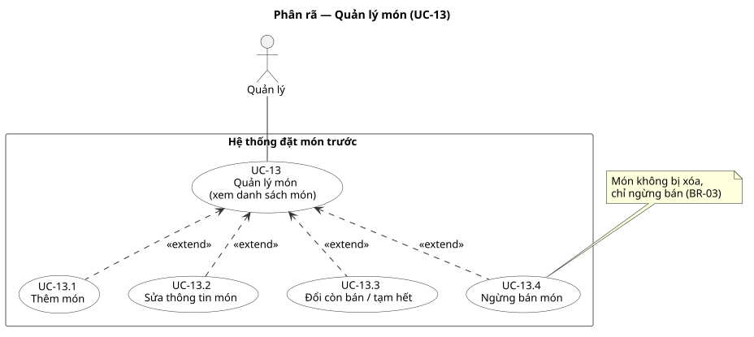
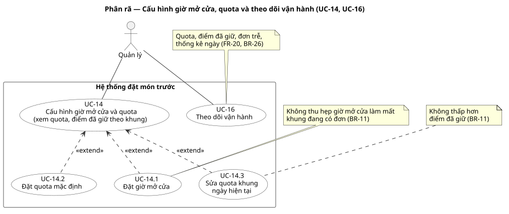

# Use Cases
Trạng thái: Use Case Model lập ở task T-04 (Sprint 1) ngày 2026-10-10 từ SRS và Product Backlog; người dùng chưa review. Use Case Specification viết ở T-05 cho các use case trong phạm vi Sprint 1, các use case còn lại đặc tả ở Sprint sau.

Input: [SRS](../SRS/SRS.md) (B.2 đối tượng sử dụng, B.3 business process, B.4 quy tắc, C chức năng FR-01–FR-20), [Product Backlog](../Product-Backlog/PRODUCT_BACKLOG.md) (PB-01–PB-21).
Thực hiện theo Bước 8 của [quy trình IT3180](../../../00-References/IT3180_PROJECT_PROCESS.md): xác định actor → xác định Use Case → sơ đồ tổng quan → phân rã.

Output:
- Actor List (mục 1).
- Use Case List (mục 2).
- Use Case Diagram tổng quan (mục 3).
- Decomposed Use Case Diagram (mục 4).
- Use Case Specification theo [mẫu](USE_CASE_TEMPLATE.md): T-05.

Các output dùng cho Activity, Analysis, UI và Test Case.

## 1. Actor List
| Actor | Mô tả | Mục tiêu chính với hệ thống | Có tài khoản | Nguồn |
|---|---|---|---|---|
| Khách vãng lai | Người truy cập web chưa đăng nhập | Xem menu; đăng ký tài khoản | Không | Quyết định 2026-10-10 (BR-34); BR-31 |
| Khách | Khách pre-order đã đăng nhập | Đặt pre-order theo khung giờ, theo dõi và hủy đơn của mình | Tự đăng ký (BR-31) | SRS B.2 |
| Nhân viên quầy | Nhân viên tại quầy | Nhập walk-in, ghi nhận thanh toán, bàn giao, hủy walk-in, đánh dấu no-show | Quản lý tạo (BR-32) | SRS B.2 |
| Nhân viên bếp | Nhân viên chế biến | Xem hàng chờ, cập nhật tiến độ đơn | Quản lý tạo (BR-32) | SRS B.2 |
| Quản lý | Người điều hành cửa hàng | Cấu hình menu, giờ mở cửa, quota; quản lý tài khoản nhân viên; hủy đơn kèm lý do; theo dõi vận hành; làm được mọi thao tác của quầy | Có sẵn khi cài đặt (BR-32) | SRS B.2 |
| Người dùng *(actor trừu tượng)* | Khái niệm chung cho mọi người có tài khoản | Đăng nhập, đăng xuất | — | Dùng để vẽ gọn |

Quan hệ tổng quát hóa giữa actor:
- Khách, Nhân viên quầy, Nhân viên bếp là **Người dùng**: cùng dùng UC-02 Đăng nhập, đăng xuất.
- **Quản lý là một Nhân viên quầy**: kế thừa mọi use case của quầy (SRS B.2 "có thể làm thao tác của quầy"), cộng thêm use case riêng. Quản lý **không** kế thừa use case của bếp.

Không phải actor:
| Đối tượng | Lý do |
|---|---|
| Khách walk-in | Không tương tác trực tiếp với hệ thống; nhân viên quầy nhập đơn và đọc mã nhận cho khách (SRS B.2, BR-20) |
| Hệ thống bên ngoài (POS, cổng thanh toán, SMS/email) | Ngoài phạm vi, không tích hợp (SRS B.1) |
| Thời gian / bộ hẹn giờ | Không có xử lý tự động theo giờ: đơn trễ chỉ hiển thị (BR-26), no-show đánh dấu bằng tay (BR-25), nhóm "cần chuẩn bị" tính khi xem hàng chờ (BR-21) |

## 2. Use Case List
Use case tổng quan (UC-01–UC-16) là mục tiêu trọn vẹn của actor. Use case dạng `UC-xx.y` là phân rã của use case cha; UC-17, UC-18 là phần hành vi dùng chung hoặc mở rộng (xem mục 4). Cột **Sprint 1**: ✓ = đặc tả ở T-05 và hiện thực trong Sprint 1; (+) = phần làm thêm nếu dư thời gian.

| ID | Use case | Actor chính | Mô tả ngắn | FR | Story | Quy tắc chính | Sprint 1 |
|---|---|---|---|---|---|---|---|
| UC-01 | Đăng ký tài khoản | Khách vãng lai | Tạo tài khoản khách bằng email hoặc SĐT chưa dùng và mật khẩu | FR-01 | PB-19 | BR-31, NFR-06 | |
| UC-02 | Đăng nhập, đăng xuất | Người dùng | Xác thực, vào chức năng theo vai trò; từ chối tài khoản bị khóa | FR-02 | PB-01 | BR-32, BR-33 | ✓ |
| UC-03 | Xem menu | Khách vãng lai, Khách, Nhân viên quầy | Xem món đang bán theo nhóm, giá, tình trạng còn bán/tạm hết | FR-05 | PB-02 | BR-04, BR-34 | ✓ |
| UC-04 | Đặt pre-order | Khách | Chọn món, chọn khung giờ trong ngày, gửi đơn; tự động xác nhận khi giữ được quota | FR-08, FR-09 | PB-06, PB-07 | BR-12, BR-15, BR-17, BR-28 | ✓ |
| UC-04.1 | Quản lý giỏ hàng | Khách | Thêm, đổi số lượng, bỏ món; xem tổng tiền | FR-08 | PB-06 | BR-04 | ✓ |
| UC-04.2 | Chọn khung giờ và gửi đơn | Khách | Xem khung hợp lệ và tình trạng còn chỗ; gửi đơn; nhận mã nhận | FR-09 | PB-07 | BR-12, BR-15, BR-17 | ✓ |
| UC-05 | Xem đơn của tôi | Khách | Danh sách, chi tiết, trạng thái, mã nhận, thanh toán, lý do hủy; tự cập nhật khi READY | FR-11 | PB-08, PB-14 | BR-33 | ✓ (tự cập nhật PB-14 ở Sprint sau) |
| UC-06 | Khách hủy đơn | Khách | Hủy đơn của mình khi còn CONFIRMED và chưa vào cửa sổ chuẩn bị | FR-12 | PB-10 | BR-23 | |
| UC-07 | Tạo đơn walk-in | Nhân viên quầy | Nhập món, xem khung dự kiến sớm nhất, xác nhận khi khách đồng ý, ghi nhận thanh toán, cấp mã | FR-13 | PB-11 | BR-18–BR-20 | |
| UC-08 | Ghi nhận thanh toán | Nhân viên quầy | Chuyển UNPAID → PAID kèm phương thức | FR-16 | PB-16 | BR-27, BR-28 | (+) |
| UC-09 | Bàn giao đơn | Nhân viên quầy | Xem đơn READY, xác minh mã, xác nhận bàn giao | FR-17 | PB-15 | BR-29 | (+) |
| UC-10 | Đánh dấu no-show | Nhân viên quầy | Đánh dấu NO_SHOW cho đơn READY quá hạn | FR-19 | PB-18 | BR-25 | |
| UC-11 | Cửa hàng hủy đơn | Nhân viên quầy (walk-in), Quản lý | Hủy đơn kèm lý do theo quyền; xử lý quota | FR-18 | PB-21 | BR-24, BR-30 | |
| UC-12 | Xử lý đơn tại bếp | Nhân viên bếp | Theo dõi hàng chờ và đưa đơn tới READY | FR-14, FR-15 | PB-12, PB-13 | BR-21, BR-22, BR-26, SRS B.5 | ✓ |
| UC-12.1 | Xem hàng chờ bếp | Nhân viên bếp | Nhóm sắp tới / cần chuẩn bị / đang làm, sắp xếp, đánh dấu trễ | FR-14 | PB-12 | BR-21, BR-22, BR-26 | ✓ |
| UC-12.2 | Cập nhật tiến độ đơn | Nhân viên bếp | CONFIRMED → PREPARING → READY | FR-15 | PB-13 | SRS B.5 | ✓ |
| UC-13 | Quản lý món | Quản lý | Xem danh sách món; thêm, sửa, đổi tình trạng, ngừng bán | FR-04 | PB-03 | BR-01–BR-03, BR-05 | |
| UC-13.1 | Thêm món | Quản lý | Tạo món với thông tin BR-01 | FR-04 | PB-03 | BR-01, BR-02 | |
| UC-13.2 | Sửa thông tin món | Quản lý | Sửa tên, nhóm, giá, điểm; không ảnh hưởng đơn đã xác nhận | FR-04 | PB-03 | BR-05, BR-08 | |
| UC-13.3 | Đổi còn bán / tạm hết | Quản lý | Chuyển tình trạng bán | FR-04 | PB-03 | BR-04, BR-05 | |
| UC-13.4 | Ngừng bán món | Quản lý | Ẩn món khỏi menu thay cho xóa | FR-04 | PB-03 | BR-03 | |
| UC-14 | Cấu hình giờ mở cửa và quota | Quản lý | Xem quota và điểm đã giữ theo khung; đặt giờ mở cửa, quota | FR-06 | PB-04 | BR-06, BR-07, BR-11 | |
| UC-14.1 | Đặt giờ mở cửa | Quản lý | Đặt giờ mở cửa, hệ thống chia khung 15 phút | FR-06 | PB-04 | BR-06, BR-11 | |
| UC-14.2 | Đặt quota mặc định | Quản lý | Quota điểm mặc định cho mọi khung | FR-06 | PB-04 | BR-07 | |
| UC-14.3 | Sửa quota khung ngày hiện tại | Quản lý | Sửa quota riêng một khung hôm nay | FR-06 | PB-04 | BR-07, BR-11 | |
| UC-15 | Quản lý tài khoản nhân viên | Quản lý | Xem danh sách; tạo, khóa, mở khóa tài khoản quầy/bếp | FR-03 | PB-20 | BR-32 | |
| UC-15.1 | Tạo tài khoản nhân viên | Quản lý | Tạo tài khoản vai trò quầy hoặc bếp | FR-03 | PB-20 | BR-32 | |
| UC-15.2 | Khóa tài khoản | Quản lý | Tài khoản bị khóa không đăng nhập được | FR-03 | PB-20 | BR-32 | |
| UC-15.3 | Mở khóa tài khoản | Quản lý | Cho tài khoản dùng lại | FR-03 | PB-20 | BR-32 | |
| UC-16 | Theo dõi vận hành | Quản lý | Tải theo khung, đơn đang xử lý, đơn trễ, thống kê ngày | FR-20 | PB-17 | BR-26 | |
| UC-17 | Kiểm tra và giữ quota | *(được include)* | Tính điểm đơn, kiểm tra quota còn lại, giữ quota cùng lúc tạo đơn; dùng chung cho pre-order và walk-in | FR-07 | PB-05 | BR-08–BR-14, NFR-01 | ✓ |
| UC-18 | Đề xuất khung thay thế | *(extend UC-04.2)* | Khung chọn không đủ quota → đề xuất tối đa 3 khung | FR-10 | PB-09 | BR-16 | |

Kiểm tra độ phủ (đối chiếu ngày 2026-10-10): mỗi FR-01–FR-20 và mỗi story PB-01–PB-21 thuộc ít nhất một use case ở bảng trên. Story PB-05 (quota) và PB-09 (đề xuất khung) không có actor riêng vì là hành vi hệ thống, nên thành use case được include/extend.

## 3. Sơ đồ Use Case tổng quan


Sơ đồ tổng quan chỉ có use case mức mục tiêu (UC-01–UC-16) và quan hệ actor. Phân rã, include, extend ở mục 4.

## 4. Sơ đồ phân rã
| Sơ đồ | Phân rã |
|---|---|
| [Tài khoản](diagrams/uc-01-tai-khoan.svg) | UC-01, UC-02; UC-15 → UC-15.1–15.3 |
| [Pre-order của khách](diagrams/uc-02-dat-pre-order.svg) | UC-03; UC-04 → UC-04.1, UC-04.2; UC-04.2 include UC-17; UC-18 extend UC-04.2; UC-05, UC-06 |
| [Quầy](diagrams/uc-03-quay.svg) | UC-07 include UC-17 và UC-08; UC-08–UC-11 |
| [Bếp](diagrams/uc-04-bep.svg) | UC-12 → UC-12.1, UC-12.2 |
| [Quản lý món](diagrams/uc-05-quan-ly-mon.svg) | UC-13 → UC-13.1–13.4 |
| [Cấu hình và theo dõi](diagrams/uc-06-cau-hinh-theo-doi.svg) | UC-14 → UC-14.1–14.3; UC-16 |













### Quy ước ký hiệu
| Ký hiệu | Nghĩa trong dự án | Ví dụ |
|---|---|---|
| Đường liền actor – use case | Actor trực tiếp thực hiện use case | Khách — UC-04 |
| Mũi tên tam giác rỗng giữa actor | Tổng quát hóa: actor con làm được mọi use case của actor cha | Quản lý → Nhân viên quầy |
| `<<include>>` (mũi tên từ use case gốc tới phần được include) | Use case gốc **luôn** thực hiện phần được include | UC-04.2 luôn thực hiện UC-17 Kiểm tra và giữ quota |
| `<<extend>>` (mũi tên từ phần mở rộng tới use case gốc) | Phần mở rộng chỉ xảy ra **khi có điều kiện** hoặc khi actor chọn | UC-18 chỉ khi khung không đủ quota; UC-13.1 Thêm món khi quản lý chọn thêm từ màn danh sách món |

Use case cha dạng "Quản lý ..." (UC-13, UC-14, UC-15) có hành vi gốc là **xem danh sách/cấu hình hiện tại**; các thao tác thêm, sửa, khóa... là phần mở rộng tùy chọn, nên dùng `<<extend>>`. UC-04 và UC-12 gồm các bước luôn xảy ra theo thứ tự, nên dùng `<<include>>`.

### Công cụ
Sơ đồ viết bằng [PlantUML](https://plantuml.com/use-case-diagram) (lựa chọn của người dùng ngày 2026-10-10, dùng chung cho các sơ đồ UML T-04–T-10). File nguồn `.puml` và file kết quả `.svg` cùng nằm trong `diagrams/`; kiểu chung ở `diagrams/_style.iuml`. Sửa file `.puml` rồi xuất lại SVG bằng Docker (Docker Desktop phải đang chạy), trong thư mục `diagrams/`:
```bash
MSYS_NO_PATHCONV=1 docker run --rm -v "$(pwd -W 2>/dev/null || pwd):/data" plantuml/plantuml:1.2026.8 -tsvg -charset UTF-8 "/data/*.puml"
```
PowerShell: `docker run --rm -v "${PWD}:/data" plantuml/plantuml:1.2026.8 -tsvg -charset UTF-8 "/data/*.puml"`. Commit cả `.puml` và `.svg`; không sửa tay file `.svg`.

## Quyết định ghi nhận ở bước này
- 2026-10-10, người dùng chọn: khách chưa đăng nhập xem được menu; thêm vào giỏ và đặt đơn cần đăng nhập. Ghi thành BR-34 trong SRS; tạo actor Khách vãng lai.
- Quản lý là tổng quát hóa của Nhân viên quầy, theo SRS B.2.
- Kiểm tra và giữ quota (FR-07) là use case được include, không có actor riêng, để thể hiện pre-order và walk-in dùng chung một logic quota (NT1, NFR-05).

## Output chuyển giao
- T-05 viết Use Case Specification cho phạm vi Sprint 1: UC-02 Đăng nhập; UC-04 Đặt pre-order (gồm UC-03, UC-04.1, UC-04.2, UC-17); UC-05 Xem đơn của tôi; UC-12 Xử lý đơn tại bếp.
- T-06 (Activity), T-07 (Analysis, Sequence), T-11 (UI) và T-23 (Test Case) dùng danh sách và ID ở đây.
